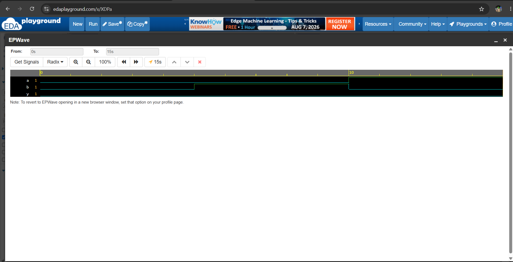

# Day 1 - Introduction to Verilog

# Objective
Learn the basic structure of a Verilog module by implementing a simple AND gate.
# Theory
Verilog is a Hardware Description Language (HDL) used to design and describe digital circuits such as logic gates, multiplexers, adders, counters, and processors.
In this experiment, we design a simple AND Gate.
## Truth Table
| A | B | Y |
|0  |  0|  0|
|0  |1  |  0|
|1  |0  |  0|
|1  |1  |  1|
## Files
- and_gate.v
- and_gate_tb.v
- waveform.png
## Learning Outcome

- Understand Verilog module structure
- Learn input and output ports
- Learn the assign statement
- Simulate the design using EDA Playground
## Waveform

