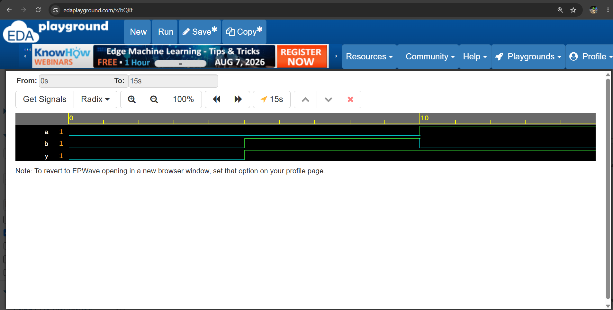
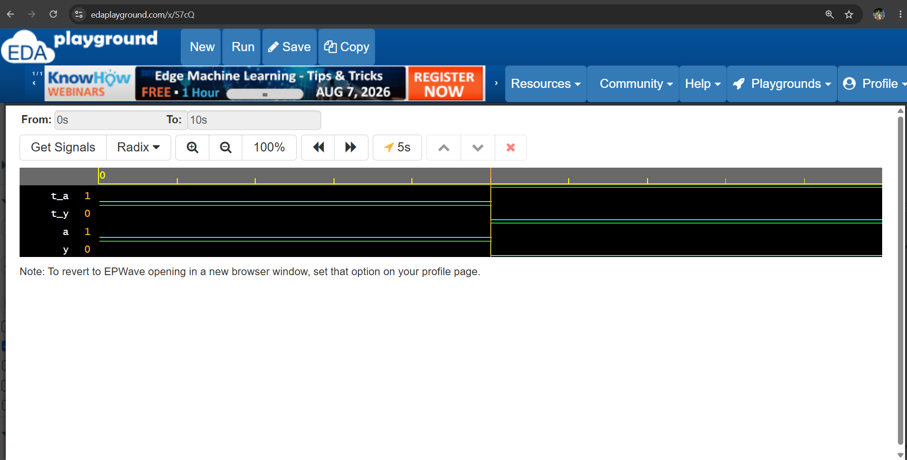

# Day 2 - OR Gate

## Objective
Learn how to design and simulate a basic OR gate using Verilog HDL.
## Boolean Expression
Y = A | B
## Truth Table
| A | B | Y |
|---|---|---|
| 0 | 0 | 0 |
| 0 | 1 | 1 |
| 1 | 0 | 1 |
| 1 | 1 | 1 |

## Files

- `or_gate.v` - OR gate RTL design
- `or_gate_tb.v` - Testbench
- `waveform.png` - Simulation waveform

## Learning Outcome

- Understand OR gate operation
- Learn Verilog OR operator `|`
- Write a basic RTL module
- Write a testbench
- Analyze simulation waveform
## Simulation Waveform

## NOT Gate

### Boolean Expression

Y = ~A

### Truth Table

| A | Y |
|---|---|
| 0 | 1 |
| 1 | 0 |

### Files

- `not_gate.v` - NOT gate RTL design
- `not_gate_tb.v` - Testbench
- `not_gate_waveform.png` - Simulation waveform

## Learning Outcome

- Understand NOT gate operation
- Learn Verilog NOT operator `~`
- Write a basic RTL module
- Write a testbench
- Generate and analyze simulation waveform

### Simulation Waveform

