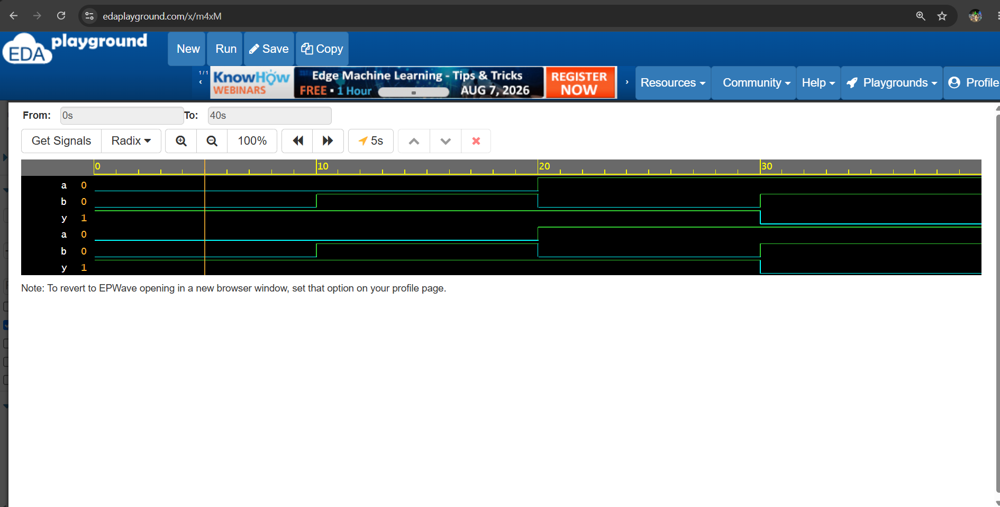
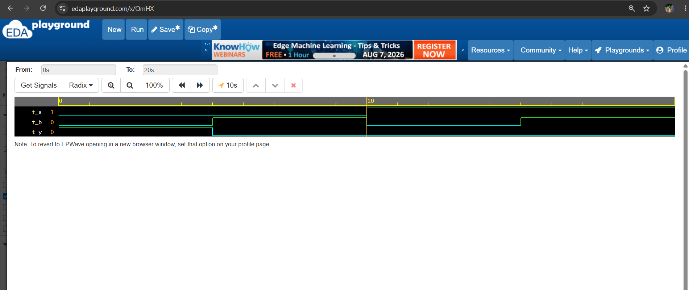
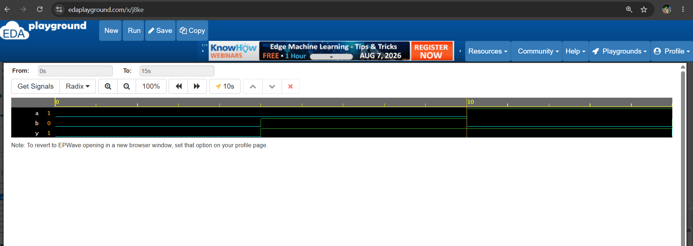

# Day 2 - OR Gate

## Objective
Learn how to design and simulate a basic OR gate using Verilog HDL.
## Boolean Expression
Y = A | B
## Truth Table
| A | B | Y |
|---|---|---|
| 0 | 0 | 0 |
| 0 | 1 | 1 |
| 1 | 0 | 1 |
| 1 | 1 | 1 |

## Files

- `or_gate.v` - OR gate RTL design
- `or_gate_tb.v` - Testbench
- `waveform.png` - Simulation waveform

## Learning Outcome

- Understand OR gate operation
- Learn Verilog OR operator `|`
- Write a basic RTL module
- Write a testbench
- Analyze simulation waveform
## Simulation Waveform


## NOT Gate

### Boolean Expression

Y = ~A

### Truth Table

| A | Y |
|---|---|
| 0 | 1 |
| 1 | 0 |

### Files

- `not_gate.v` - NOT gate RTL design
- `not_gate_tb.v` - Testbench
- `not_gate_waveform.png` - Simulation waveform

## Learning Outcome

- Understand NOT gate operation
- Learn Verilog NOT operator `~`
- Write a basic RTL module
- Write a testbench
- Generate and analyze simulation waveform

### Simulation Waveform


# Day 2 - NAND Gate

## Objective

Learn the working of a NAND gate and implement it using Verilog HDL.

## Theory

NAND gate is a combination of an **AND gate followed by a NOT gate**.

The output of a NAND gate is LOW (`0`) only when both inputs are HIGH (`1`).

In Verilog, the NAND operation can be written as:

verilog
assign y = ~(a & b);
##Truth Table
| A | B | A & B | Y = ~(A & B) |
| - | - | ----- | ------------ |
| 0 | 0 | 0     | 1            |
| 0 | 1 | 0     | 1            |
| 1 | 0 | 0     | 1            |
| 1 | 1 | 1     | 0            |
### Simulation Waveform


# Day 2 - NOR Gate

## Objective

Learn the working of a NOR gate and implement it using Verilog HDL.

## Theory

A NOR gate is a combination of an **OR gate followed by a NOT gate**.

The output of a NOR gate is HIGH (`1`) only when **both inputs are LOW (`0`)**.

In Verilog, the NOR operation can be written as:

```verilog
assign y = ~(a | b);
```

## Boolean Expression

```text
Y = ~(A | B)
```

## Truth Table
| A | B | A|B | Y=~(A|B)|
| 0 | 0 | 0   | 1       |
| 0 | 1 | 1   | 0       |
| 1 | 0 | 1   | 0       |
| 1 | 1 | 1   | 0       |

## Simulation Waveform



## Learning Outcome

* Understand NOR gate operation.
* Learn the Verilog OR operator `|`.
* Learn how to combine the OR operator with the NOT operator `~`.
* Write a basic NOR gate RTL module.
* Write a Verilog testbench.
* Generate and analyze the simulation waveform.

## Files

* `nor_gate.v` - NOR gate RTL design
* `nor_gate_tb.v` - Testbench
* `nor_gate_waveform.png` - Simulation waveform

## Summary

A NOR gate produces a HIGH (`1`) output only when **all inputs are LOW (`0`)**. It is a **universal logic gate**, meaning that basic logic gates can be constructed using only NOR gates.

## Day 3 - XOR Gate
## Objective
Learn how to design and simulate a basic XOR gate using Verilog HDL.

## Boolean Expression

Y = A ^ B

## Truth Table
| A | B | Y |
| - | - | - |
| 0 | 0 | 0 |
| 0 | 1 | 1 |
| 1 | 0 | 1 |
| 1 | 1 | 0 |

## Files
`xor_gate.v` - XOR gate RTL design.
`xor_gate_tb.v` - Testbench.
`xor_gate_waveform.png` - Simulation waveform . 

## Learning Outcome
Understand XOR gate operation
Learn Verilog XOR operator ^
Write a basic RTL module
Write a testbench
Generate and analyze simulation waveform

## Simulation Waveform


# Day 3 - XNOR Gate

## Objective

Learn how to design and simulate a basic XNOR gate using Verilog HDL.

## Theory

XNOR (Exclusive-NOR) gate is the complement of an XOR gate. The output of an XNOR gate is HIGH (`1`) when both inputs are the same and LOW (`0`) when the inputs are different.

In Verilog, the XNOR operation can be written as:

```verilog
assign y = ~(a ^ b);
```

## Boolean Expression

```text
Y = ~(A ^ B)
```

## Truth Table

| A | B | A ^ B | Y = ~(A ^ B) |
| - | - | ----- | ------------ |
| 0 | 0 | 0     | 1            |
| 0 | 1 | 1     | 0            |
| 1 | 0 | 1     | 0            |
| 1 | 1 | 0     | 1            |

## Simulation Waveform

## Learning Outcome

* Understand XNOR gate operation.
* Learn the Verilog XOR operator `^`.
* Learn how to combine the XOR operator with the NOT operator `~`.
* Write a basic XNOR gate RTL module.
* Write a Verilog testbench.
* Generate and analyze the simulation waveform.

## Files

* `xnor_gate.v` - XNOR gate RTL design
* `xnor_gate_tb.v` - Testbench
* `xnor_gate_waveform.png` - Simulation waveform

## Summary

An XNOR gate produces a HIGH (`1`) output when **both inputs are the same**. It produces a LOW (`0`) output when the inputs are different. XNOR gates are commonly used in **equality checking and digital comparison circuits**.
