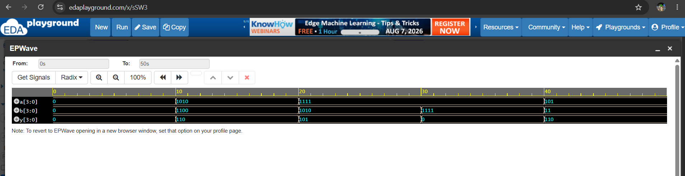
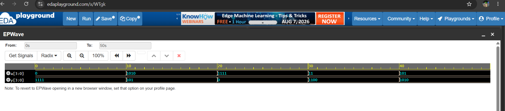

# Bitwise AND Operator

## Objective

Learn how to use the **bitwise AND (`&`) operator** in Verilog HDL with 4-bit inputs.

## Boolean Expression

```text
Y = A & B
```

The bitwise AND operation performs an AND operation on each corresponding bit of the two input vectors.

## Truth Table
| A | B | Y = A & B |
| - | - | --------- |
| 0 | 0 | 0         |
| 0 | 1 | 0         |
| 1 | 0 | 0         |
| 1 | 1 | 1         |

### 4-bit Example

```text
A = 1010
B = 1100
---------
Y = 1000
```

## Verilog Code

The 4-bit bitwise AND operation is implemented using:

```verilog
assign y = a & b;
```

## Files

* `bitwise_and.v` - Bitwise AND RTL design
* `bitwise_and_tb.v` - Testbench for verifying the design
* `bitwise_and_waveform.png` - Simulation waveform
* `README.md` - Project documentation

## Test Cases
| A    | B    | Y = A & B |
| ---- | ---- | --------- |
| 0000 | 0000 | 0000      |
| 1010 | 1100 | 1000      |
| 1111 | 1010 | 1010      |
| 1111 | 1111 | 1111      |
| 0101 | 0011 | 0001      |

## Simulation Waveform

The waveform shows the changes in the input signals `a` and `b` and the corresponding output `y` during simulation.


## Learning Outcome

* Understand the bitwise AND operation.
* Learn the Verilog bitwise AND operator `&`.
* Understand operations on 4-bit vectors.
* Write a basic RTL module.
* Write a Verilog testbench.
* Generate a VCD waveform file.
* Analyze the simulation waveform.

## Summary

The **bitwise AND operator (`&`)** compares corresponding bits of two input vectors. The output bit is `1` only when both corresponding input bits are `1`.

For example:

```text
1010
1100
----
1000
```

This demonstrates how the Verilog bitwise AND operator can be used to perform logic operations on multi-bit signals.

# Bitwise OR Operator

## Objective

Learn how to use the **bitwise OR (`|`) operator** in Verilog HDL with 4-bit inputs.

## Boolean Expression

```text
Y = A | B
```

The bitwise OR operation performs an OR operation on each corresponding bit of the two input vectors.

## Truth Table

| A | B | Y |
|---|---|---|
| 0 | 0 | 0 |
| 0 | 1 | 1 |
| 1 | 0 | 1 |
| 1 | 1 | 1 |

### 4-bit Example

```text
A = 1010
B = 1100
---------
Y = 1110
```

## Verilog Code

The 4-bit bitwise OR operation is implemented using:

```verilog
assign y = a | b;
```

## Files

* `bitwise_or.v` - Bitwise OR RTL design
* `bitwise_or_tb.v` - Testbench for verifying the design
* `bitwise_or_waveform.png` - Simulation waveform
* `README.md` - Project documentation

## Test Cases

| A    | B    | Y = A | B |
| ---- | ---- | --------- |
| 0000 | 0000 | 0000      |
| 1010 | 1100 | 1110      |
| 1111 | 1010 | 1111      |
| 1111 | 1111 | 1111      |
| 0101 | 0011 | 0111      |

## Simulation Waveform

The waveform shows the changes in the input signals `a` and `b` and the corresponding output `y` during simulation.


## Learning Outcome

* Understand the bitwise OR operation.
* Learn the Verilog bitwise OR operator `|`.
* Understand operations on 4-bit vectors.
* Write a basic RTL module.
* Write a Verilog testbench.
* Generate a VCD waveform file.
* Analyze the simulation waveform.

## Summary

The **bitwise OR operator (`|`)** compares corresponding bits of two input vectors. The output bit is `1` when **at least one** of the corresponding input bits is `1`.

For example:

```text
1010
1100
----
1110
```

This demonstrates how the Verilog bitwise OR operator can be used to perform logic operations on multi-bit signals.
# Bitwise XOR Operator

## Objective

Learn how to use the **bitwise XOR (`^`) operator** in Verilog HDL with 4-bit inputs.

## Boolean Expression

```text
Y = A ^ B
```

The bitwise XOR operation performs an exclusive-OR operation on each corresponding bit of the two input vectors.

## Truth Table

| A | B | Y = A ^ B |
| - | - | --------- |
| 0 | 0 | 0         |
| 0 | 1 | 1         |
| 1 | 0 | 1         |
| 1 | 1 | 0         |

### 4-bit Example

```text
A = 1010
B = 1100
---------
Y = 0110
```

## Verilog Code

The 4-bit bitwise XOR operation is implemented using:

```verilog
assign y = a ^ b;
```

## Files

* `bitwise_xor.v` - Bitwise XOR RTL design
* `bitwise_xor_tb.v` - Testbench for verifying the design
* `bitwise_xor_waveform.png` - Simulation waveform
* `README.md` - Project documentation

## Test Cases

| A    | B    | Y = A ^ B |
| ---- | ---- | --------- |
| 0000 | 0000 | 0000      |
| 1010 | 1100 | 0110      |
| 1111 | 1010 | 0101      |
| 1111 | 1111 | 0000      |
| 0101 | 0011 | 0110      |

## Simulation Waveform

The waveform shows the changes in the input signals `a` and `b` and the corresponding output `y` during simulation.



## Learning Outcome

* Understand the bitwise XOR operation.
* Learn the Verilog bitwise XOR operator `^`.
* Understand operations on 4-bit vectors.
* Write a basic RTL module.
* Write a Verilog testbench.
* Generate a VCD waveform file.
* Analyze the simulation waveform.

## Summary

The **bitwise XOR operator (`^`)** compares corresponding bits of two input vectors. The output bit is `1` when the corresponding input bits are **different**, and `0` when they are the same.

For example:

```text
1010
1100
----
0110
```

This demonstrates how the Verilog bitwise XOR operator can be used to perform exclusive-OR operations on multi-bit signals.
# Bitwise NOT Operator

## Objective

Learn how to use the **bitwise NOT (`~`) operator** in Verilog HDL with a 4-bit input.

## Theory

The bitwise NOT operation inverts every bit of the input vector.

* `0` becomes `1`
* `1` becomes `0`

Unlike a NOT gate with a single input bit, a **bitwise NOT** operation can be applied to a multi-bit vector.

## Boolean Expression

```text id="f3p5qk"
Y = ~A
```

## Truth Table

For a single bit:

| A | Y = ~A |
| - | ------ |
| 0 | 1      |
| 1 | 0      |

### 4-bit Example

```text id="j5kj9v"
A = 1010
---------
Y = 0101
```

Another example:

```text id="k0o4j7"
A = 1100
---------
Y = 0011
```

## Verilog Code

The 4-bit bitwise NOT operation is implemented using:

```verilog id="y2u6fq"
assign y = ~a;
```

## Files

* `bitwise_not.v` - Bitwise NOT RTL design
* `bitwise_not_tb.v` - Testbench for verifying the design
* `bitwise_not_waveform.png` - Simulation waveform
* `README.md` - Project documentation

## Test Cases

| A    | Y = ~A |
| ---- | ------ |
| 0000 | 1111   |
| 1010 | 0101   |
| 1111 | 0000   |
| 1100 | 0011   |
| 0101 | 1010   |

## Simulation Waveform

The waveform shows the changes in the input signal `a` and the corresponding inverted output `y` during simulation.



## Learning Outcome

* Understand the bitwise NOT operation.
* Learn the Verilog bitwise NOT operator `~`.
* Understand bit inversion for multi-bit vectors.
* Write a basic RTL module.
* Write a Verilog testbench.
* Generate a VCD waveform file.
* Analyze the simulation waveform.

## Summary

The **bitwise NOT operator (`~`)** inverts every bit of a vector. Each `0` becomes `1`, and each `1` becomes `0`.

For example:

```text id="v1nj0n"
Input  = 1010
Output = 0101
```

This demonstrates how the Verilog bitwise NOT operator can be used to invert all bits of a multi-bit signal.

