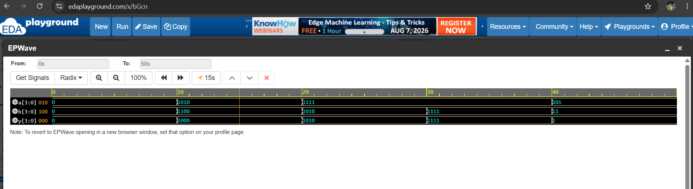
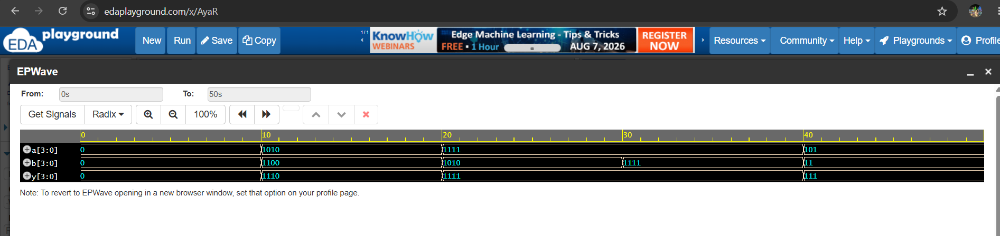

# Bitwise AND Operator

## Objective

Learn how to use the **bitwise AND (`&`) operator** in Verilog HDL with 4-bit inputs.

## Boolean Expression

```text
Y = A & B
```

The bitwise AND operation performs an AND operation on each corresponding bit of the two input vectors.

## Truth Table
| A | B | Y = A & B |
| - | - | --------- |
| 0 | 0 | 0         |
| 0 | 1 | 0         |
| 1 | 0 | 0         |
| 1 | 1 | 1         |

### 4-bit Example

```text
A = 1010
B = 1100
---------
Y = 1000
```

## Verilog Code

The 4-bit bitwise AND operation is implemented using:

```verilog
assign y = a & b;
```

## Files

* `bitwise_and.v` - Bitwise AND RTL design
* `bitwise_and_tb.v` - Testbench for verifying the design
* `bitwise_and_waveform.png` - Simulation waveform
* `README.md` - Project documentation

## Test Cases

| A    | B    | Y = A & B |
| ---- | ---- | --------- |
| 0000 | 0000 | 0000      |
| 1010 | 1100 | 1000      |
| 1111 | 1010 | 1010      |
| 1111 | 1111 | 1111      |
| 0101 | 0011 | 0001      |

## Simulation Waveform

The waveform shows the changes in the input signals `a` and `b` and the corresponding output `y` during simulation.



## Learning Outcome

* Understand the bitwise AND operation.
* Learn the Verilog bitwise AND operator `&`.
* Understand operations on 4-bit vectors.
* Write a basic RTL module.
* Write a Verilog testbench.
* Generate a VCD waveform file.
* Analyze the simulation waveform.

## Summary

The **bitwise AND operator (`&`)** compares corresponding bits of two input vectors. The output bit is `1` only when both corresponding input bits are `1`.

For example:

```text
1010
1100
----
1000
```

This demonstrates how the Verilog bitwise AND operator can be used to perform logic operations on multi-bit signals.

# Bitwise OR Operator

## Objective

Learn how to use the **bitwise OR (`|`) operator** in Verilog HDL with 4-bit inputs.

## Boolean Expression

```text
Y = A | B
```

The bitwise OR operation performs an OR operation on each corresponding bit of the two input vectors.

## Truth Table

| A | B | Y = A | B |
| - | - | --------- |
| 0 | 0 | 0         |
| 0 | 1 | 1         |
| 1 | 0 | 1         |
| 1 | 1 | 1         |

### 4-bit Example

```text
A = 1010
B = 1100
---------
Y = 1110
```

## Verilog Code

The 4-bit bitwise OR operation is implemented using:

```verilog
assign y = a | b;
```

## Files

* `bitwise_or.v` - Bitwise OR RTL design
* `bitwise_or_tb.v` - Testbench for verifying the design
* `bitwise_or_waveform.png` - Simulation waveform
* `README.md` - Project documentation

## Test Cases

| A    | B    | Y = A | B |
| ---- | ---- | --------- |
| 0000 | 0000 | 0000      |
| 1010 | 1100 | 1110      |
| 1111 | 1010 | 1111      |
| 1111 | 1111 | 1111      |
| 0101 | 0011 | 0111      |

## Simulation Waveform

The waveform shows the changes in the input signals `a` and `b` and the corresponding output `y` during simulation.



## Learning Outcome

* Understand the bitwise OR operation.
* Learn the Verilog bitwise OR operator `|`.
* Understand operations on 4-bit vectors.
* Write a basic RTL module.
* Write a Verilog testbench.
* Generate a VCD waveform file.
* Analyze the simulation waveform.

## Summary

The **bitwise OR operator (`|`)** compares corresponding bits of two input vectors. The output bit is `1` when **at least one** of the corresponding input bits is `1`.

For example:

```text
1010
1100
----
1110
```

This demonstrates how the Verilog bitwise OR operator can be used to perform logic operations on multi-bit signals.
